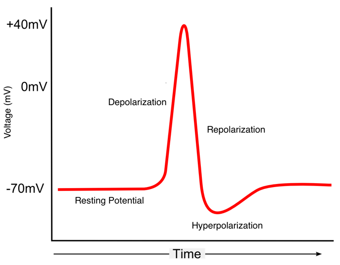

---
output:
  pdf_document: default
  html_document: default
---
# Hodgkin and Huxley Model {#Ch2}  

## Vocabulary  

* Depolarization
* Positive Feedback
* Hyperpolarization
* Negative Feedback
* Membrane Potential
* Sodium-Potassium Pump
* Nernst Potential
* Reversal Potential
* Equilibrium Potential
* Driving Force
* Conductance
* Leak Current
* Leaky Integrate and Fire Model
* Absolute Refractory Period
* Gating variable  


## Introduction  

  Before you read this chapter, we would like to draw your attention to this [video](https://www.youtube.com/watch?v=dzj95jHuPiw). We call this a Zombie Squid because the squid is in fact dead; however, it is recently deceased.  Since the squid passed shortly before, Adenosine triphosphate (ATP) energy stores are still available to the squid’s muscles.  When the soy sauce, which has a lot of sodium chloride (salt) in it, is poured onto the squid, the salt in the soy sauce causes a voltage change which causes the squid’s muscles to contract.  Thus, we have a Zombie Squid.  
  
  So why is the Zombie Squid important? The Hodgkin-Huxley Model, said to have started the field of computational neuroscience, all hinges on the giant axons of squid. In the 1950s Alan Hodgkin and Andrew Huxley built a model that shows us how computers can successfully predict certain aspects of the brain that cannot be directly studied.  The two even won a Nobel Prize in Physiology or Medicine in 1963 with Sir John Carew Eccles for their model.  The Hodgkin-Huxley Model is now the basis of all conductance-based models.  As a result, we can now understand how an action potential works, and why it is an all-or-none event.  
  
  While Hodgkin and Huxley created their model in the 1950s, the first recording of an action potential was done by Edgar Adrian in the 1920s. However, the first person to realize that neurons communicate via electrical signals came much earlier in 1791, when Luigi Galvani found that electricity from lightning or primitive batteries can cause a dead frog’s leg muscle to contract. This led to a good amount of Frankenstein-like science with interested parties running electricity through dead bodies in an attempt to bring them back to life.  However, the next truly scientific discovery came from Hermann Helmholtz in the 19th century.  Helmholtz found that he could measure the speed of muscles contracting when he stimulated the nerve linked to that specific muscle.  The Hodgkin-Huxley Model was then created once Adrian noted that not only were action potentials discrete, but the firing rate (spike per second) increased as stimulation to the nerve increased.  
  
**Exercise:** Briefly explain how the Zombie Squid moves. Why is this important to understand?  

## What is an action potential?  

```{r channel1-fig, fig.cap="A cell at rest has more potassium ions intracellular than extracellular and more sodium ions extracellular than intracellular. There is a negative net charge within the cell being maintained by the  voltage gradient.", fig.width = 2, echo=FALSE}
knitr::include_graphics("images/channel1.png")
```

```{r channel2-fig, fig.cap="When the cell becomes depolarized sodium ions enter the cell. The charge within the cell becomes more positive.", fig.width = 1, echo=FALSE}
knitr::include_graphics("images/channel2.png")
```

```{r channel3-fig, fig.cap="When the cell repolarizes potassium ions leave the cell. The charge within the cell go from positive to negative as it goes back to the resting state.", fig.width = 1, echo=FALSE}

```

```{r actionPotential-fig, fig.cap="Example of an action potential.", fig.width = 2, echo=FALSE}

```

  Before going into ways of modelling action potentials, let’s further explore what an action potential is. Within a cell, there are more sodium ions outside the membrane, which have a positive charge. Because there are less positive ions inside the cell compared to the outside, the inside of the cell has a negative resting potential. When there is a spike of voltage, that causes both voltage-gated sodium and potassium channels–meaning that these channels activate and inactivate at certain voltages–to activate on a neuron’s membrane.  However, the sodium channels open much faster than the potassium channels. The flow of sodium ions into the cell causes the membrane potential to become more positive.  This process of positive ions flowing into the cell is called **depolarization**.  When depolarization happens, it causes additional sodium channels to open, which causes further depolarization---this phenomenon is called **positive feedback**, and the positive feedback starts if the depolarization hits a set threshold.  In other words, a positive feedback loop is a process that perpetuates itself.  The positive feedback loop ends once voltage-gated potassium channels also open at the peak of the action potential and potassium begins flowing out of the cell and ending depolarization, we call this **repolarization**. When the voltage is below the resting potential, we call this undershoot **hyperpolarization**, which is when the membrane potential decreases towards a move negative value via potassium ions flowing out.  As the voltage-gated potassium channels open and the voltage-gated sodium channels to close or become inactivated, there is now **negative feedback**. Negative feedback is a process by which an initial change is opposed by a force caused by the initial change.  In this situation, the positive feedback causes a spike in membrane potential and the negative feedback stabilizes. 
  
**Exercise:**
```{r actionPotentialEx-fig, fig.cap="Here is a diagram that shows different stages of an action potential. Use the knowledge we learned in the last section, identify the stages on the graph. How are these stages relate to positive/negative feedback? What kinds of channels are open/closed during the respective stages?", fig.width = 2, echo=FALSE}

```

**Exercise:** Explain how depolarization and hyperpolarization relate to positive/negative feedback.  


## Nernst equilibrium potential  

  The electrical activity generated in a neuron is a result of ions flowing across the neuron’s membrane which is caused by the following two principles: opposite charges attract, and concentration gradients seek to equalize. This potential difference is referred to as the **membrane potential**. In order for ions to flow, a concentration gradient must be established because the difference in concentration across the membrane leads it to pass either into the neuron or out of the neuron. This is accomplished by the **sodium-potassium pump**, which uses just below 10% of your body’s daily energy to pump three sodium ions out of the neuron for every two potassium ions pumped in, thus forming two respective concentration gradients.
  
  With the concentration gradient established, the sodium and potassium ions will flow down the concentration gradients when their respective channels open, generating an electrical current that propagates down the axon. We must also take into account the fact that each ion possesses a charge–or charges in the case of Ca++ and Mg++–and that as this charge is built up on one side of the cell, this will generate an electrical force that will begin to repel ions with similar charge as they try to flow down their concentration gradient. When the force of the concentration gradient matches the electrical force attracting or repelling the ion, this is known as the **Nernst potential** for that ion, also referred to as the **reversal potential**. This means that means that both sodium and potassium possess their own respective Nernst potentials. Nernst potentials are especially important because they allow us to calculate the membrane voltage when a particular ion is in equilibrium, which helps to define the role it plays in an action potential.  
  
  The Nernst potential for an ion can be derived from the following equation: $$E_{ion} = \frac{RT}{zF}ln(\frac{[out]}{[in]}) $$

```{r echo = FALSE,warning=FALSE, message=FALSE, results='asis'}
library(knitr)
library(kableExtra)
data <- read.csv(file='tables/nernst.csv',header = TRUE, sep = ',')
kable(data) %>%
  kable_styling(bootstrap_options = c("striped", "hover", "condensed", "responsive"))
```
  While the Nernst potential will give the equilibrium point for a single ion, it also has a relation to the **equilibrium potential** or the resting potential the membrane, which is potential at which there is no net flow of ions, leading to a halt in the flow of electric current. The equilibrium potential is really a weighted average of all of the Nernst potentials and is modeled by the Goldman-Hodgkin-Katz equation which is shown below:  $$V_{m} = \frac{RT}{F}ln(\frac{P_{K}[K+]_{out}+P_{Na}[Na+]_{out}+P_{Cl}[Cl-]_{in}}{P_{K}[K+]_{in}+P_{Na}[Na+]_{in}+P_{Cl}[Cl-]_{out}}) $$
  
  This equation utilizes the membrane permeability, *P*, in conjunction with the concentration of each ion inside and outside of the cell to produce the equilibrium potential of a membrane. Using this equation alongside the Nernst potential, the **driving force**, which is a representation of the pressure for an ion to move in or out of the cell, can be calculated using the following equation: $$DF = V_{m}-E_{ion} $$
  
  The Nernst Potential, the Goldman-Hodgkin-Katz equation, and the driving force present necessary calculations that allow for better understanding of the flow of ions in relation to an action potential.  
  
**Exercise:** Why does depolarization not continue indefinitely once voltage-gated Na+ channels have opened?  

**Exercise:** Briefly explain the concept of driving force.  

**Exercise:** Explain the difference between the membrane potential, Nernst potential and equilibrium potential.  

## The Hodgkin and Huxley model  

<div style = "float:left;width:564px">
```{r hodgkinHuxley-fig, fig.cap="Alan Hodgkin (left) and Andrew Huxley (right).", fig.width = 2, echo=FALSE}
knitr::include_graphics("images/HodgkinHuxley.png")
```
</div> 

  Alan Hodgkin (pictured left) and Andrew Huxley (pictured right) were two Cambridge University undergraduates who eventually found themselves working in a marine biology laboratory with the axon of a giant squid.  The two men were able to derive the necessary information for their influential model of an action potential using the massive axon of the giant squid.  
  
  Hodgkin and Huxley developed a series of equations that could accurately predict and depict action potentials. Their work is a cornerstone for computational modeling as computer modelling can now be used to mimic the biological properties of a neuron that we are unable to directly observe. 
  
  Really the Hodgkin-Huxley Model is just an elaboration on the Integrate and Fire Model. The Integrate and Fire model was generated by French neuroscientist Louis Lapicque, who in 1907 sought to generate a mathematical model that could be used to predict and graph an action potential. In his efforts to understand action potentials, Lapicque chose to model the flow of ions as a single **leak current**.  
  
  Hodgkin and Huxley took the single conductance term from the Integrate and Fire Model is broken up into three separate conductance terms, each relating to a different ion channel. These conductance terms are known as **gating variables** and are labeled *m*, *n*, and *h*. Voltage-gated sodium channel activation is modeled by the letter *ms*. Voltage-gated sodium channels have three subunits, as these three subunits are involved in the channels activation, *m* is raised to the third power. Voltage-gated sodium channel also inactivate at the peak of the action potential and this variable is modeled by the letter *h*. The combination of *m* and *h* gives rise to the conductance of Voltage-gated sodium channel which is modeled below: $$\bar{g}_{Na}m^{3}h(V(t)-E_{Na}) $$
  Voltage-gated potassium channels are modeled by the letter *n*. Voltage-gated potassium channels have four subunits, and thus the gating variable, *n*, is raised to the fourth power. The conductance of Voltage-gated potassium channels is modeled below: $$\bar{g}_{K}n^{4}(V(t)-E_{K} $$
  The final conductance taken into account by Hodgkin and Huxley is the leak potential of all the ions. The Leak conductance is taken into account for the instance when all ion channels are open. This conductance is represented below: $$\bar{g}_{L}(V(t)-E_{L}) $$
  These three conductance variables are combined together to form the Hodgkin-Huxley equation which is written as follows: $$C\frac{dV}{dt}=I_{e}(t)-[(\bar{g}_{Na}m^{3}h(V(t)-E_{Na}))+(\bar{g}_{K}n^{4}(V(t)-E_{K}))+(\bar{g}_{L}(V(t)-E_{L}))] $$  


```{r echo = FALSE,warning=FALSE, message=FALSE, results='asis'}
library(knitr)
library(kableExtra)
data <- read.csv(file='tables/hodgkinHuxley.csv',header = TRUE, sep = ',')
kable(data) %>%
  kable_styling(bootstrap_options = c("striped", "hover", "condensed", "responsive"))
```
  Additionally, we can calculate the value of each gating variable over different voltages and times: $$m\frac{dV}{dt} = \alpha_{m}(V)(1-m)-\beta_{m}(V)m $$
  Both *n* and *h* can be substituted for *m* in the above equation in order to calculate values for each gating variable. Additionally, note the $\alpha$ and $\beta$ in the equation are rate constants that govern the opening and closing (respectively), of their channels. Here are their values:  
$$ \alpha_{n}(V_{m}) = \frac{0.01(V_{m}+55)}{1-exp(-0.1(V_{m}+55))} $$
$$\alpha_{m}(V_{m}) = \frac{0.1(V_{m}+40)}{1-exp(-0.1(V_{m}+40))}$$
$$\alpha_{h}(V_{m}) = 0.07exp(-0.05(V_{m}+65)) $$
$$\beta_{n}(V_m) = 0.125exp(-0.0125(V_{m}+65)) $$
$$\beta_{m}(V_{m}) = 4exp(-0.0556(V_{m}+65)) $$
$$\beta_{h}(V_{m}) = \frac{1}{1+exp(-0.1(V_{m}+35))} $$
```{r echo = FALSE,warning=FALSE, message=FALSE, results='asis'}
library(knitr)
library(kableExtra)
data <- read.csv(file='tables/alphaBeta.csv',header = TRUE, sep = ',')
kable(data) %>%
  kable_styling(bootstrap_options = c("striped", "hover", "condensed", "responsive"))
```

## Summary  
An action potential is the electro-chemical signal that propagates down a neuron. Action potentials are facilitated by the electrochemical gradient that is maintained through the action of the Sodium-Potassium Pump. The role that each ion plays within the action potential can be determined through the use of the Nernst Equation, which allows us to understand the movement of a specific ion at a specific membrane voltage. Understanding the role of ions, is important, but this is not how we actually graph an action potential. One of the first modules developed to graph an action potential was the integrate and fire module. This equation disregarded all of the biomechanical features of an action potential and focused on the subthreshold membrane dynamics of a neuron. This model was relatively effective, until Hodgkin and Huxley reassessed it and changed the single leak resistance in integrate and fire to three separate resistance terms. Hodgkin and Huxley in doing this created an equation that more thoroughly analyzed and depicted the very action potential that is displayed to this day.  

##Exercises:##
Here is a code that models the Hodgkin-Huxley model. Fill in the blanks and try to understand what each line of code does. Why does the code calculate $\alpha$ and $\beta$ values first?  
```{python, eval=FALSE, echo=TRUE, python.reticulate=FALSE}
import numpy as np
import matplotlib.pyplot as plt

# Define model parameters
dt          = 0.1 # time step (ms)
tFinal      = 1000 # total time of run (ms)
tStimStart  = 250 # time to start injecting current (ms)
tStimEnd    = 750 # time to end injecting current (ms)
c           = 10 # capacitance per unit area (nF/mm^2)
gMaxL       = 3 # leak maximal conductance per unit area (mS/mm^2)
EL          = -54.387 # leak conductance reversal potential (mV)
gMaxK       = 360 # maximal K conductance per unit area (mS/mm^2)
EK          = -77 # K conductance reversal potential (mV)
gMaxNa      = 1200 # maximal Na conductance per unit area (mS/mm^2)
ENa         = 50 # Na conductance reversal potential (mV)

# set up data structures to hold relevant variable vectors
timeVec = np.zeros(0, tFinal, dt)
voltageVec = np.zeros(len(timeVec))
Ivector = np.zeros(len(timeVec))

# Fill in the BLANK!
mVec = np.zeros(     )
hVec = np.zeros(     )
nVec = np.zeros(     )

# assign the initial value of each variable
# For initial voltage, we set the resting potential to -65 mV
voltageVec[0] = -65
Ie = 200
mVec[0] = 0.0529
mVec[0] = 0.5961
nVec[0] = 0.3177

# For-loop to integrate equations into model
# Can you see why we are subtracting 1 here?
for i in range(    ):
  # Calculate alpha values for m, h, and n
  # These functions are fit from empirical data
  alpha_m = 0.1 * (voltageVec[i]+40)/(1-np.exp(-0.1*(voltageVec[i]+40)))
  alpha_h = 0.07 * np.exp(-0.05*(voltageVec[i]+65))
  alpha_n = 0.01 * (voltageVec[i]+55) / (1-np.exp(-0.1*(voltageVec[i]+55)))
  
  # Calculate beta values
  beta_m = 4*np.exp(-0.05556*(voltageVec[i]+65))
  beta_h = 1 / (1+np.exp(-0.1*(voltageVec[i]+35)))
  beta_n = 0.125 * np.exp(-0.01125*(voltageVec[i]+55))
  
  # Calculate tau values for m, h, and n
  tau_m = 1 / (alpha_m + beta_m)
  tau_h = 1 / (alpha_h + beta_h)
  tau_n = 1 / (alpha_n + beta_n)
  
  # Calculate inf values for m, h, and n
  infM = alpha_m / (alpha_m + beta_m)
  infH = alpha_h / (alpha_h + beta_h)
  infN = alpha_n / (alpha_n + beta_n)
  
  # Calculate and store values in m, h, and n vectors
  mVec[i+1] = infM + (mVec[i] - infM) * np.exp(-dt/tau_m)
  hVec[i+1] = infH + (hVec[i] - infH) * np.exp(-dt/tau_h)
  nVec[i+1] = infN + (nVec[i] - infN) * np.exp(-dt/tau_n)
  
  # Calculate and store values in the tau voltage vector
  tauVec = c/(gMaxK*nVec[i]**4+gMaxNa*mVec[i]**3 * hVec[i]+gMaxL)
  vInf = (gMaxK*nVec[i]**4 * EK + gMaxNa*mVec[i]**3 * hVec[i]*ENa + gMaxL*EL + IVector[i])
  / (gMaxK*nVec[i]**4+gMaxNa*mVec[i]**3 * hVec[i]+gMaxL)
  voltageVec[i+1] = vInf + (voltageVec[i]-vInf) * np.exp(-dt/tauVec[i])
```
