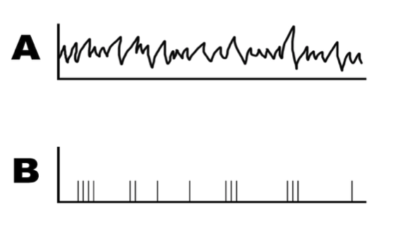
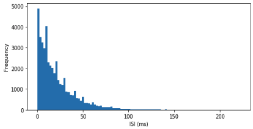
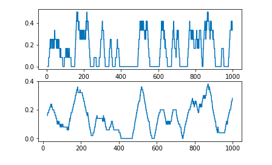
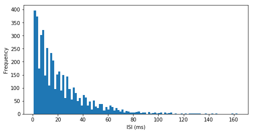
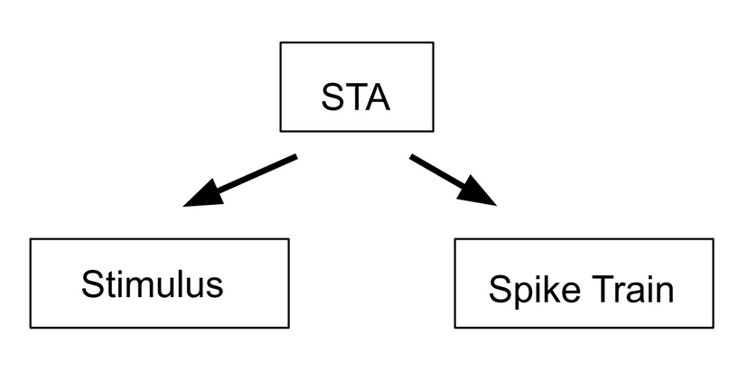
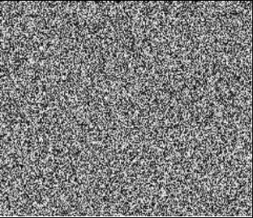
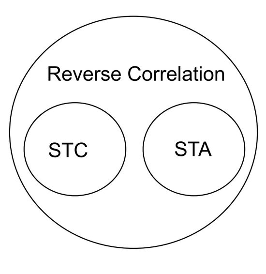
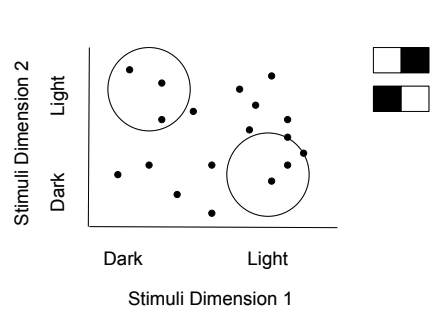

# Reverse Correlation and Receptive Field Mapping {#Ch3}

## Vocabulary  

* Poisson process  
* Spike train  
* Peri-stimulus time histogram  
* Spike count rate  
* Interspike interval  
* Fano factor  
* Coefficient of variation  
* Spike-triggered average  
* White noise
* Reverse correlation  

## Introduction
  Throughout our everyday lives, we receive an enormous amount of sensory inputs from our surrounding environment: the color of the clouds before sunset, the melody played by an old record player, the smell of apple pie, or the taste of your favorite dish. Our brain, with its incredible computational capacity, successfully encodes all these sensory inputs from different modalities to something we can perceive and understand, in the language of neurons. Our discussion from previous chapters noted that the language of neurons--or the neural code--consists of action potentials that are all-or-none events, and we learned how neurons fire an action potential. In this chapter, we are going to talk about why neuron fires and how to characterize and analyze these action potentials using spike trains. Based on this, we are going to discuss ways to study the relationship between outside stimuli and neural responses.  
  
## Spike Trains  
<div style = "float:right;width:561px">
```{r spikeTrain-fig, fig.cap="Example of a spike train. Graph A shows the recorded stimulus and graph B shows the recorded actions potentials during the stimulus.", fig.width = 2, echo=FALSE}

```
</div> 

  Assume that we measured a neuron firing in response to a sensory stimulus, and we recorded its voltage changes and displayed the signal in an oscilloscope. How should we analyze the information encoded in these action potentials? As we mentioned before, the action potential is an all-or-none event. This binary characteristic gives us a way to simplify the complicated voltage response curve: for every time point in our measurement, if there is a spike firing, denote its value as 1; if not, denote it as 0. After the recording, we get a sequence of 0s and 1s in a time-dependent order. We commonly refer to this sequence as a spike train, shown in Figure 1, part B.  
  
  
  Since all action potentials fire to the same voltage level, there is no difference in their intensities. Thus, in order to have action potentials that convey meaningful information, neurons can only vary on timing of firing, including varying firing rates or varying the time intervals between each firing. Although this seems super-simplified, our spike train contains mostly the information we need to analyze if we want to know what causes the original neuron to fire. In order to systematically analyze these data in spike trains, we first need to define some statistics.


## Spike Statistics  

  Now we have a sequence of 0s and 1s which represent neural firing, the next step is to calculate the **spike count rate**, which is the number of spikes divided over a given time interval. This parameter directly shows the firing rate, but it cannot reflect variation. Assume that we have two neurons that have the same spike count rate. One is a regular-firing neuron and the spikes are evenly distributed along the time axis, while the other is a bursting neuron that fires sets of spikes with longer intervals between individual sets. How can we distinguish between these two spike trains? Here, we want to introduce another parameter called the **interspike interval (ISI)** or in other words, the time interval between every pair of spikes. In Figure 2, there is a histogram that shows the distribution of ISIs from an artificial spike train. The ISI histogram can be characterized by **coefficient of variation (CV)**, which is the standard deviation of ISIs divided by the mean of it. Apart from that, we can also use the **Fano factor** to measure the spike variability. It is calculated by the variance of the number of spikes divided by the mean number of spikes in a given time interval. Compare to CV, Fano factor is less dependent on the intervals between spikes but more on the number of spikes in a given time bin. If the underlying firing rate varies or the spike firing in irregular time points, both CV and Fano factor increase. Thus, CV and Fano factors are useful secondary statistics that helps to measure variability in spike trains.  
  
```{r poissonISI-fig, fig.cap="Distribution of ISIs from a randomly firing artificial neuron.", fig.width = 2, echo=FALSE}

```

  We can do a lot with a single spike train. However, in vivo, neural responses are highly variable and the response of a neuron to the same stimulus may even vary from trial to trial. Effectively, to account for the cross-trial variability, we need to analyze results from multiple trials to get a better estimate of the average neural response. A **peristimulus time histogram (PSTH)** can be generated by averaging across trials. The most direct method is to put trials in small time windows that correspond to each time point and calculate the spike count rate in window for each time point. By implementing this process, each time point is assigned an average rate, and by plotting we get a continuous frequency curve. One example is shown in the Exercise 1, in the "spike density" section, in which spikes are averaged in time windows, and then averaged across trials. In this case, all trials are run on the same neuron, which reduces the cross-trial variability and increases the time resolution. The response, however, may be affected by adaptation. Furthermore, we can also assess the firing pattern of a population of neurons by calculating the average spike counting rate for all the time points, and then averaging across trials. At this point, different trials are run on different neurons, and the generated response curve accounts for the response pattern of a population of neurons in the area that was tested. This method, while it generates better time resolution, omits the possible variability across neurons in the population. 
  Choosing different time windows influences the characteristics of the frequency curve, as shown in Figure 3. In general, PSTH is essential because it transforms a discontinuous spike train into continuous response curves, which allows us to calculate the correlation between stimulus and response. This will be further elaborated upon in the later sections.  
  
**Exercise 1:** What are the pros and cons for each type of histogram?  

```{r echo = FALSE,warning=FALSE, message=FALSE, results='asis'}
library(knitr)
library(kableExtra)
data <- read.csv(file='tables/firingRates.csv',header = TRUE, sep = ',')
kable(data) %>%
  kable_styling(bootstrap_options = c("striped", "hover", "condensed", "responsive"))
```


```{r firingRate-fig, fig.cap="PSTH generated from different time windows. The size of the time window gets larger from top to bottom(0.005s, 0.025s, and 0.050s). While the smaller time window retains more information of the original spike train, the bigger time window gives a more smooth and continuous output.", fig.width = 2, echo=FALSE}

```

  Sometimes, instead of collecting data from real neurons, we need to simulate spike trains from given statistics. The artificial spike trains can be compared with real data, or used to reconstruct possible firing patterns with a given stimulus. Here, we will discuss the homogeneous Poisson process, or the simplest way of generating artificial spike train. The homogeneous **Poisson process** entails that for every small interval on the timeline, the probability of an event happening (in our case, action potential) will be proportional to the length of the time interval, while the proportionality constant *r* is fixed. To understand this abstract definition, think about a timeline whereby at each time point, we throw a coin and record the head as 1. Try to visualize that timeline. We agree that all 1s will be randomly spread along the timeline, and the interval between when we get a pair of heads, varies along the timeline. This will look very similar to an artificial spike train generated by the Poisson process, whose distribution can be expressed by the following formula:  $$p(q\ spikes\ in\ \Delta{t}) = e^{-\lambda}\frac{\lambda^{n}}{n!} $$


```{r poisson-fig, fig.cap="An artificial spike train generated by Poisson process and its ISI distribution. Notice that the spikes are randomly distributed along the time axis, and the ISI histogram has an exponential distribution.", fig.width = 2, echo=FALSE}

```

**Exercise 2**: Explain the qualifications for a poisson spike train?  

## Spike-triggered Average  

  An essential tool for describing neurons, and how they respond to certain stimuli, is the **spike-triggered average (STA)**. The STA is the average value of the stimulus during some time interval before a spike occurs. Researchers record a neuron's activity as it responds to various stimuli. First, the researchers must determine the amount of time before a spike they want to analyze. Once the data has been obtained and the time step determined, the value of the one-time step before a spike is recorded, and averaged across trials. This value ultimately characterizes the level of stimulus necessary for the neuron to fire. It is important to note that the spike-triggered average is measuring the average level of the stimulus, not of the neuron. This calculation is based on the probability of a neuron spiking due to stimuli activity to occur in the recent past.

```{r STA-fig, fig.cap="The spike triggered average can be used to calculate both the stimulus and the spike train.", fig.width = 2, echo=FALSE}

```
  
  <div style = "float:left;width:312px">
```{r whiteNoise-fig, fig.cap="Example of a white noise stimulus using gray scale.", fig.width = 2, echo=FALSE}

```
</div>
  The spike-triggered average can be utilized to determine the receptive fields of individual neurons. However, when using the STA to determine receptive fields, the stimulus presented to the recording neuron must be sufficiently random. If it isn’t, any correlation in stimuli will be presented in the generated receptive field, thus skewing the result. A **white noise**, is a type of stimulus with random variation where the value at each time point is independent of all other points. White noise can be employed in these instances to provide a receptive field without bias. White noise stimuli can look different based on the neuron and the system being observed, from a series of random auditory frequencies to randomly generated pixels stimulating the visual cortex. For each set of stimuli, the value at each time point does not correlate with the values around it. For more information on spike-triggered average analyses, especially concerning receptive fields,[read this experiment.](https://jov.arvojournals.org/article.aspx?articleid=2193104)

## Reverse Correlation  
```{r STA2-fig, fig.cap="Reverse correlation encompasses both spike triggered averages and spike triggered covariance.", fig.width = 2, echo=FALSE}

```
  When analyzing neurons and neuronal responses, there are two main factors: the inputs (controlled by researchers), and the outputs (measured by researchers). The process of **reverse correlation** implements the analysis of outputs to determine the inputs that the neuron will respond to with a spike. The spike-triggered average is an application of this process as it looks back at the stimuli preceding a spike to determine information about the sensitivity and response of the neuron. In addition to spike-triggered average, a calculation known as spike-triggered covariance can be used to analyze neuronal responses. Spike-triggered covariance (STC) can be used to identify multi-dimensional inputs to a neuron and is especially useful in linear-nonlinear Poisson models that will be discussed later in this section. STC uses the covariance, variability between two factors, of stimuli that trigger spikes in a neuron to determine a neuron's response characteristics to multi-dimensional stimuli.  

  The basic model for reverse correlation is a Linear Single Input Single Output system (LSISOS). Such linear systems assume the two principles of homogeneity. First, the neuron will not undergo processes such as habituation and will always respond in the same way to the stimulus. Second, superposition: the response from multiple stimuli will be equal to the sum of the individual stimuli. In this model, the LSISOS response is the sum of the spikes scaled to time. Similar to spike-triggered averages, it is best to input a white noise stimulus and then cross-correlate it with its output, which will give you the spike-triggered average. In cross-correlation, the higher the similarity between the two values (the stimulus value and the output value), the greater the correlation value (the spike-triggered average).  
  
  The LSISOS model assumes a linear activity of neurons that is not entirely accurate due to neuron characteristics such as a spike threshold and a refractory period. A new model, known as the linear-nonlinear-Poisson model takes these factors into account. There are three stages to this model: linear stage, nonlinear stage, and the Poisson spike generator stage. The linear stage considers how a neuron responds to a specific feature in a spatio-temporal linear sense. The second stage takes the linear output and input through a nonlinear function to give a neuron's instantaneous spike rate. The nonlinear function can either be a logistic curve or a rectified linear (ReLU) function. The final step translates the output of the initial steps into spikes using an inhomogeneous Poisson process. The final result from the Poisson generator demonstrates the areas of the stimulus where a spike is more likely to occur.  
  Reverse correlation is a technique used for understanding what neurons are responding to, and the spike-triggered averages discussed earlier are one example of how reverse correlation is implemented.  
  
```{r STC-fig, fig.cap="Spike-triggered covariance shows how two different stimuli dimensions can be calculated together.", fig.width = 2, echo=FALSE}

```

## Summary  
  Reverse correlation and all the concepts that play a role in this widely implemented technique, from different modes of spike statistics to various types of stimuli, can be an intimidating topic in computational neuroscience. Analyzing the relationship between inputs and outputs to understand the effect each has on the activity of a neuron is the root of this topic. These analyses can move in both directions: input to output, or output to input. One can manipulate the stimulus and measure the resulting spike train through various statistical methods, or one could use reverse correlation by utilizing the known output of a spike to look back and understand the input necessary to create such a response. These analyses are working on grasping what stimuli the neuron does, or does not, “like”. In other words, they help us predict the neuron’s responses.  
  
**Exercise 3 (*Challenge!*)**
Match each concept to the Python function.  

Concepts:  

* Fano Factor
* Spike Count Rate
* Interspike Interval

```{python, eval=FALSE, echo=TRUE, python.reticulate=FALSE}
# Function 1
prob = 45/1000
spikeMatrix = np.zeros((1000,1000))
for i in range(1000):
  for j in range(1000):
    if np.random.rand() < prob:
      spikeMatrix[i,j] = 1
spikeCountRates = np.sum(spikeMatrix, 1)
plt.figure(figsize=(8,8))
plt.subplot(2,1,1)
plt.hist(spikeCountRates, 40, edgecolor='black')
plt.xlabel("Average firing rate (Hz)")
plt.ylabel("Frequency")
```

```{python, eval=FALSE, echo=TRUE, python.reticulate=FALSE}
# Function 2
np.var(spikeCountRates) / np.mean(spikeCountRates)
```

```{python, eval=FALSE, echo=TRUE, python.reticulate=FALSE}
# Function 3
spikeCountRates = np.sum(spikeMatrix, 1)
totalSpikes = int(np.sum(spikeMatrix, axis=None))
isi = np.zeros(totalSpikes - 1)
count = -1
for i in range(1000):
  spikes = np.nonzero(spikeMatrix[i,:])[0]
  for j in range(len(spikes)-1):
    count += 1
    isi[count] = spikes[j+1] - spikes[j]
plt.subplot(2,1,2)
plt.hist(isi, 100)
plt.xlabel("ISI (ms)")
plt.ylabel("Frequency")
```
